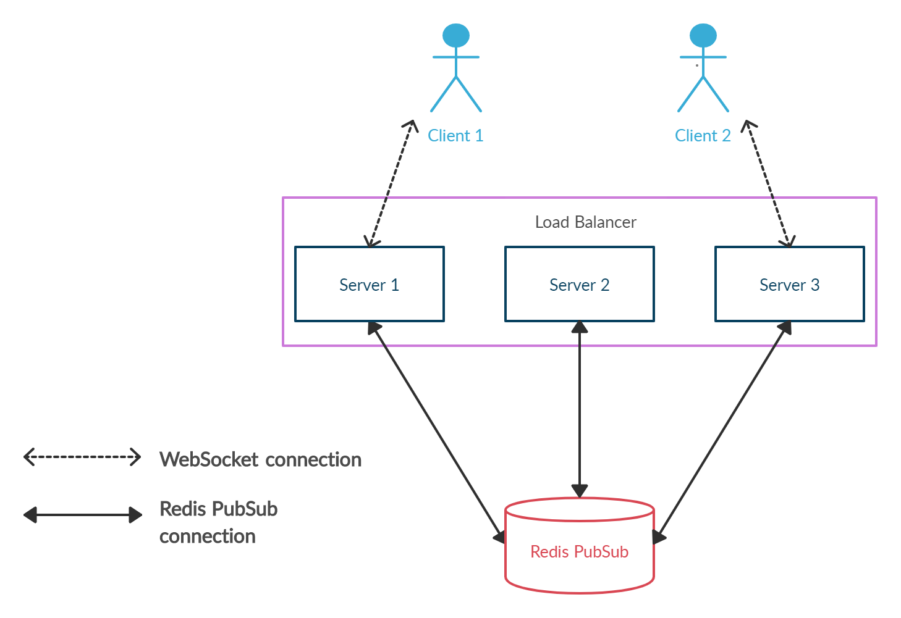

Changing your existing application to support real time is absolutely becoming a common demand. Before you dive in to add some code, you must ask yourself some questions.

I must note I write this post after a research I’ve done in order to upgrade my existing application (which uses [React](https://reactjs.org), [Redux](https://redux.js.org) and [Apollo Server](https://www.apollographql.com/docs/apollo-server) for [GraphQL](https://graphql.org)) to real time.

## Does the existing technology in my application already support real time?
Before you go to explore some technologies, I recommend you to explore if your exist tech stack supports getting live updates or similar things.

I wrote this recommendation because in my team's application we have been using Apollo Server for GraphQL, and I know GraphQL has something called **Subscriptions**.

From [Graphql Blog](https://graphql.org/blog/subscriptions-in-graphql-and-relay): 
> just as the list of mutations that the server supports describes all of the actions that a client can take, the list of subscriptions that the server supports describes all of the events that it can subscribe to. Just as a client can tell the server what data to refetch after it performs a mutation with a GraphQL selection, the client can tell the server what data it wants to be pushed with the subscription with a GraphQL selection.

So the first thing I explored was how Apollo Server supports GraphQL Subscription. I was happy to find [Apollo Server has full support for Subscriptions](https://www.apollographql.com/docs/apollo-server/data/subscriptions). It's a huge benefit that a big part of your application has built in support for live updates.

If you don't find something like that, go find a popular technology that can connect easily to your existing frameworks/libraries.

## What kind of real time do I need in my application?
 Photo by [Sharon McCutcheon](https://unsplash.com/@sharonmccutcheon?utm_source=unsplash&utm_medium=referral&utm_content=creditCopyText) on [Unsplash](https://unsplash.com/s/photos/boxes?utm_source=unsplash&utm_medium=referral&utm_content=creditCopyText)

You should ask yourself if you need updates like notifications from the server (unidirectional communication), or duplex messages like group chatting, multiplayer games, video conferencing (bidirectional communication). 
And why do I mention this? Because many people tend to choose a new trend before they really need it. For example, in our situation I talk about [WebSocket protocol](https://wikipedia.org/wiki/WebSocket). I definitely agree WebSockets is amazing but I also think not everybody needs it.

WebSocket is a protocol that provides us full-duplex communication channels over a single [TCP](https://wikipedia.org/wiki/Transmission_Control_Protocol) connection. Yes, the TCP connection must be stay open, therefore it can be overkill to maintain a open connection that you don't need. If you choose WebSocket protocol anyway, use a proper library that manages the connection for you.
In some situations, Long-Polling can be the right choice, you don't need an open connection and it's based on HTTP protocol ([See a quick comparison of real time technologies](https://stackoverflow.com/questions/11077857/what-are-long-polling-websockets-server-sent-events-sse-and-comet)).

If you find a library that impresses you but doesn't have support for your preferred technology (Long-Polling, SSE, WebSocket), you can still consider that library. It will probably manage the hard parts for you.

For example, when I did research for our team's app I discovered Long-Polling could be good enough for us. We didn't need bidirectional communication, only updates from a server. I found that GraphQL Subscriptions in Apollo Server is only supported via WebSocket, so I had to choose whether to stick with GraphQL Subscriptions or choose another technology (alternatives to Apollo Server are not an option).

Eventually, I made a decision to go with GraphQL subscriptions and I took the risk of maintaining an open connection. I've been using [Apollo Client](https://www.apollographql.com/docs/react) in our client side in order to keep an open connection.

## Would I need a new component to maintain?
 Photo by [Leone Venter](https://unsplash.com/@fempreneurstyledstock?utm_source=unsplash&utm_medium=referral&utm_content=creditCopyText) on [Unsplash](https://unsplash.com/s/photos/boxes?utm_source=unsplash&utm_medium=referral&utm_content=creditCopyText)

After you research some topics we've talked about earlier, you‘d probably need a new component in your architecture. Why? because if your application actually runs in a production environment, you have more than one instance for your server. It leads you to add a messaging system component to your architecture. 

Technologies such as Apache ActiveMQ and RabbitMQ were initially designed primarily for message queuing use cases. Other technologies such as Apache Kafka, Google Cloud Pub/Sub and Redis PubSub were designed primarily to support publish-subscribe use cases. 

In my team's case we need a publish-subscribe system. After some searches we chose Redis PubSub, a great product that fits our needs and has a great library that integrates with GraphQL Subscriptions.

Note that you must maintain a new component, monitor it, take care of logs and more. Wake up, you will be having a baby soon and you’ll need to look after it ... 

My advice for you is to check if your team already has a similar messaging system you can connect to, I promise that you can save the headache of maintaining and monitoring.

In addition, if you choose using the WebSocket protocol, make sure you have a corresponding **load balancer**. It's very important, you choose to hold a lot of open connections so you must take care of it.
We have a load balancer in our application but it doesn’t have support for the WebSocket protocol so we must replace it with another.

I've made a diagram to make it clear:

##Should I consider real time as reliable?
In my opinion the answer is actually **no**. Perhaps the performance is great, and you might not need to spend too much time to learn a real time technology, but you cannot trust those as reliable. Think about it like fire & forget: when the server sends a message for the client, it will never know if the message is received or not
(Of course, you can implement it yourself but often this is the situation). 

## Conclusions
In this post, we’ve noticed some issues to care about before diving in. I've given you some tips and examples from my life but you could choose any technology you like. The bottom line is, the questions remain as they are.

Thank you for reading!

Cover image by [Cris Tagupa](https://unsplash.com/@cjtagupa?utm_source=unsplash&utm_medium=referral&utm_content=creditCopyText) on [Unsplash](https://unsplash.com/s/photos/boxes?utm_source=unsplash&utm_medium=referral&utm_content=creditCopyText)
